# Ibrahim Ahmadli

MS in Computer Science at Columbia, ML track. Previously CS + Economics at UW–Madison — a long way of saying I like building things and I like knowing whether they worked.

Lately that's meant an AI career platform with 300+ users, a restaurant discovery app, a leather goods storefront, and a retrieval system for thyroid cancer patients that's headed to the American College of Surgeons Clinical Congress. Recurring theme: I ship it, then spend twice as long finding out where it breaks — which is how I found out one of my own products was confidently making things up, and how a semester of regression work ended with six of eight predictors falling apart under scrutiny.

Before all that: audit at EY, and a summer keeping the systems running at Azerbaijan's national space agency.

New York now. Four languages, one very over-automated apartment, and an ongoing project to eat at every restaurant in the city.

**Languages**

**Frontend**

**Backend & data**

**AI / ML**

**Infra**

---

## What I'm building

### [CareerLab](https://www.thecareerlab.live) — AI career exploration platform, 300+ users

Students test careers through hands-on job simulations instead of reading descriptions. I own the architecture end to end. Retrieval-grounded generation over a curated career corpus rather than raw LLM output — Pinecone vector store, OpenAI embeddings, LangChain plumbing — chosen for output grounding and predictable inference cost. Also built the Clara AI companion (shared session and retrieval layer across embedded widget and sidebar surfaces), the partner analytics dashboard, and the admin tooling. Monorepo with Zod schemas and Drizzle tables shared between client and server, and a Vitest suite covering unit, integration, and security paths against a real Postgres, gated in CI.

`React` `TypeScript` `Vite` `Express` `PostgreSQL` `Drizzle` `Pinecone` `OpenAI` `Tailwind`

  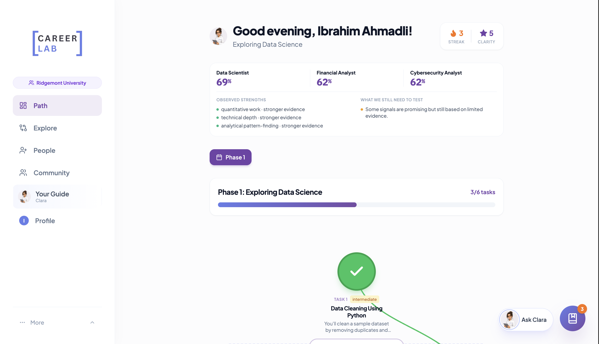
  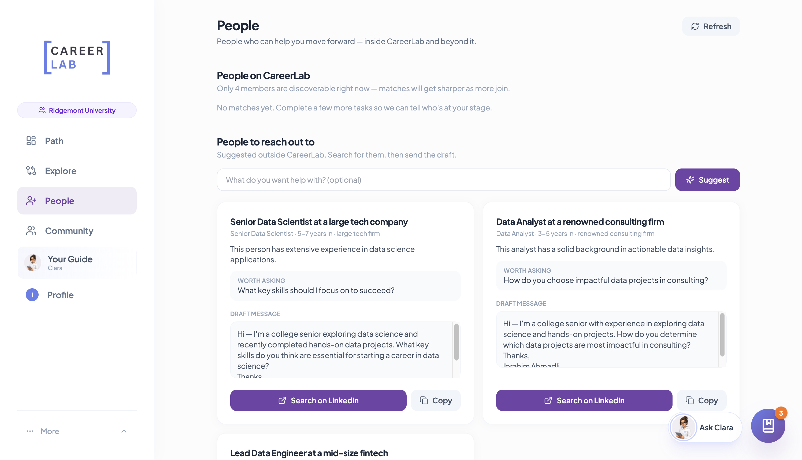

  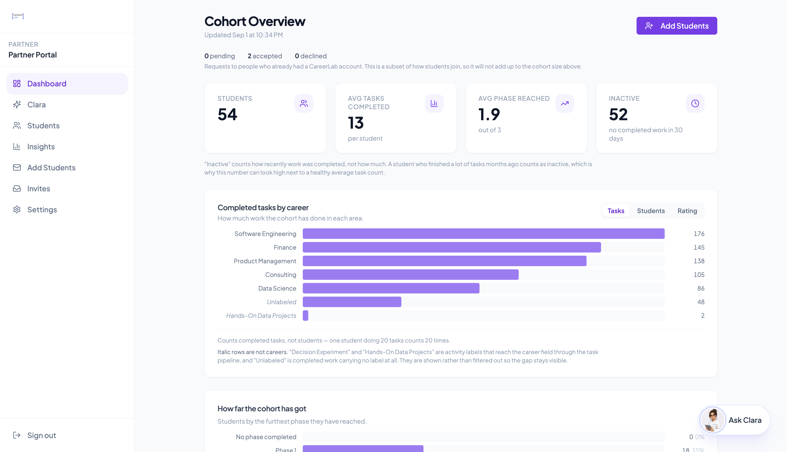
  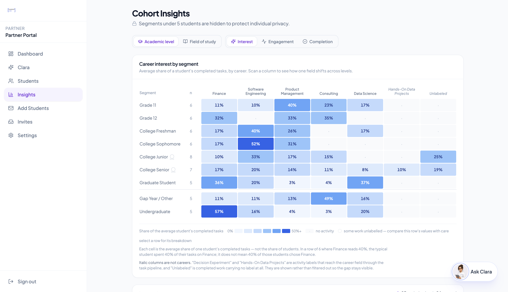

---

### [Revio](https://explorerevio.com) — social restaurant discovery, mobile

Group-first restaurant discovery: location-weighted hangout ranking, real-time 1:1 and group chat, and swipe/bracket polls for deciding where to eat. Built with a co-developer. Most of the interesting work has been on correctness under real conditions — offline handling, backend scale audits, and a production-behavior testing practice that caught rounding bugs synthetic test data missed twice.

`React Native` `Expo` `Supabase` `TypeScript`

  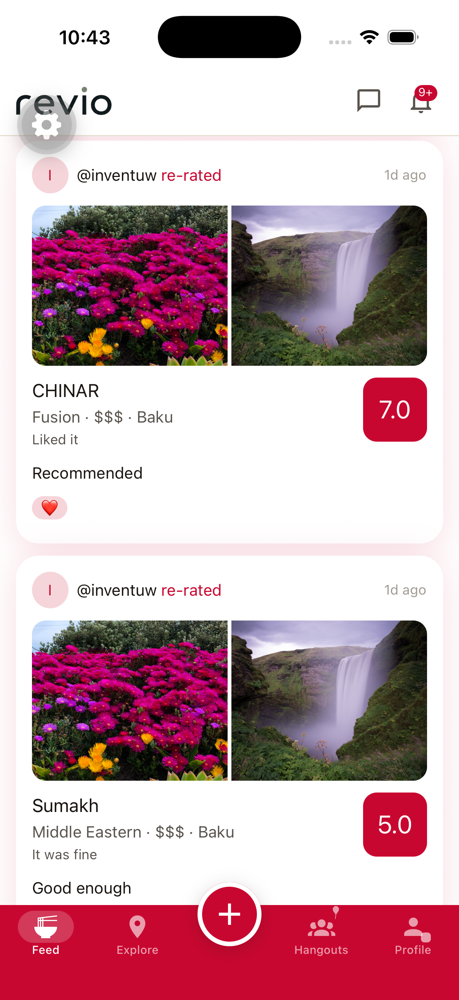
  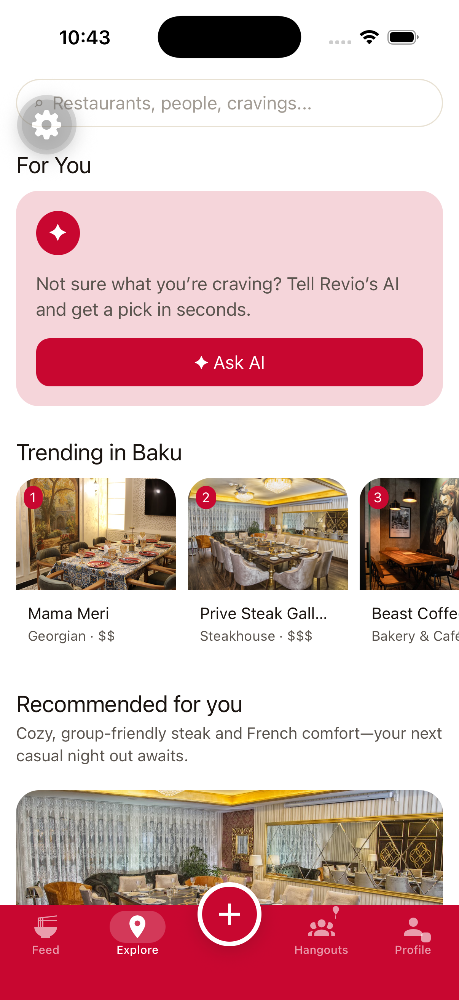
  

---

### [HEYBE Atelier](https://heybeatelier.com) — premium leather goods, custom storefront

Built the storefront from scratch rather than using Shopify — catalog, cart, checkout, and admin. Interesting constraint: Stripe doesn't support AZN, so payments run through a local provider, and the store currently uses a feature-flagged reserve-to-order flow instead of live checkout.

`Next.js` `Prisma` `Supabase` `Vercel`

  

---

### [BestTrans](https://besttranslogistic.com) — interactive 3D site

Frontend build for a logistics business, structured around interactive 3D dioramas
rather than a conventional page layout. Mostly an exercise in scene composition,
asset weight, and keeping the thing smooth on mid-range devices.

`Three.js` `React`

  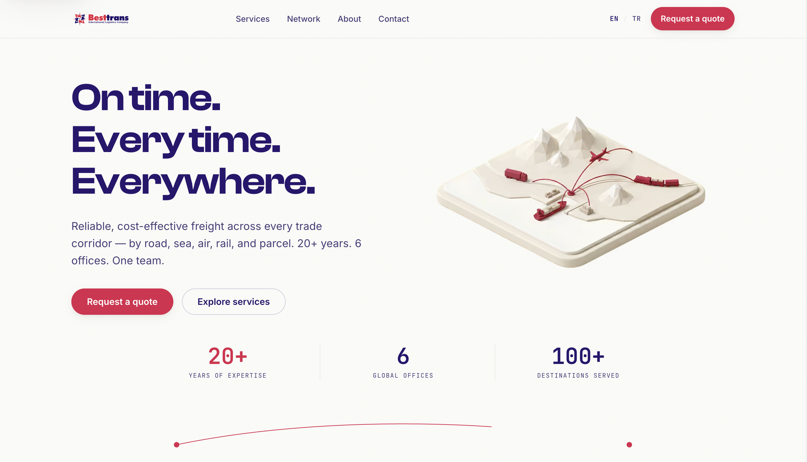

---

## Research & analysis

### Thyroaid, Clinical RAG system — Molecular Imaging & MR Lab, UW–Madison

Retrieval-augmented guidance system over 160+ clinical papers, reaching 92%+ source-citation accuracy with 44% lower response latency through IVF-FLAT indexing and a retrieve-then-rerank pipeline. Co-designed the validation study benchmarking six LLMs against 177 physician-verified queries. Accepted for long oral presentation at the American College of Surgeons Clinical Congress.

On aggregate score the RAG system landed level with the strongest standalone model. The gain shows up in the dimensions that matter clinically: completeness 9.5 vs 6.8 and safety 9.6 vs 8.9 against the non-RAG average — retrieval mostly stops the model from leaving things out.

📄 [ACS Clinical Congress abstract (PDF)](papers/thyroaid-acs-abstract.pdf) · [Presentation slides (PDF)](papers/thyroaid-symposium.pdf)

### Predicting violent crime hotspots in Chicago — ECON 695, group project

Built a 789-tract panel from 8.5M Chicago crime incidents and 311 service requests spanning 2018–2025. Pooled OLS explained 79% of cross-sectional variation, but adding tract-level fixed effects collapsed six of eight disorder indicators — graffiti, infrastructure, abandonment, and sanitation all lost significance once each neighborhood was compared only to itself. Only property/street crime and vice/public disorder survived, and both held under a one-year lag. Replicated on 1,212 Los Angeles tracts as an external validity check.

The maps below show homicide counts and vacant building complaints by tract; the overlap on the south and west sides is the visual version of the regression result.

  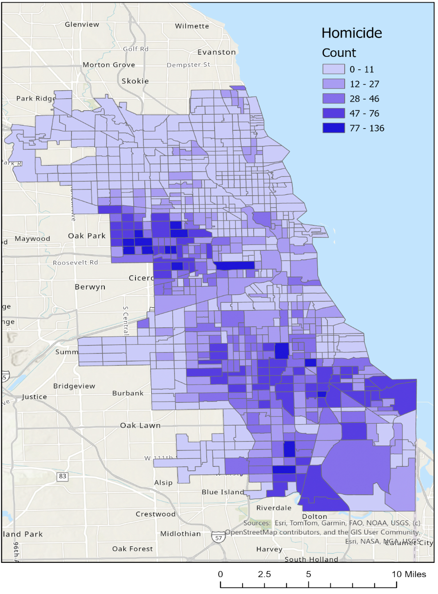
  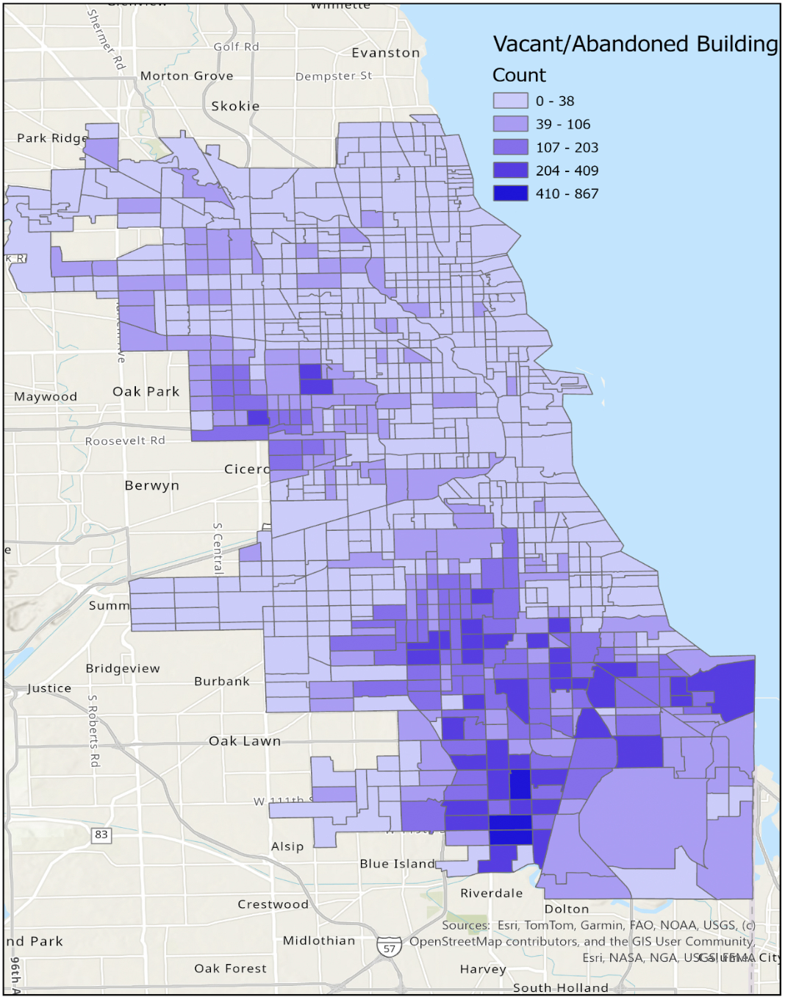

  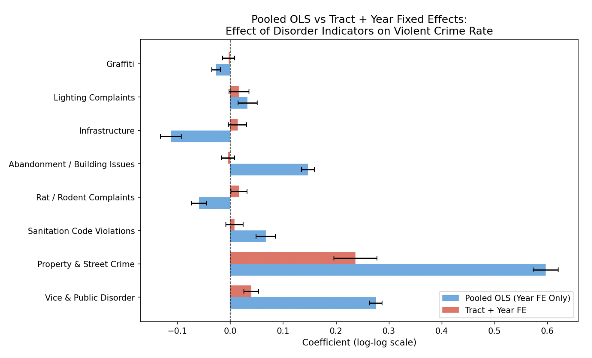
  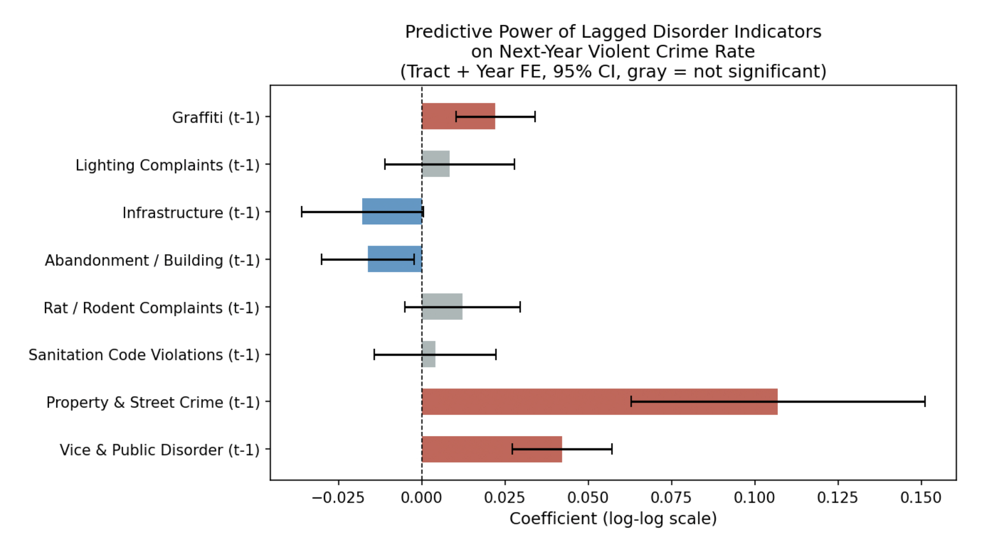

📄 [Full paper (PDF)](papers/chicago-violent-crime.pdf) — ECON 695 coursework, included in full so the methods and results are inspectable.

### Predicting restaurant revenue

Compared OLS, ridge, LASSO, random forest, and gradient boosting on 137 restaurants
across 43 variables, with a 70/30 split and 10-fold cross-validated penalty tuning in R.

The interesting part is where OLS fails. On raw revenue it produced a *negative*
out-of-sample R² — worse than just predicting the mean — because 37 heavily
correlated predictors on 137 observations is a recipe for overfitting. Regularization
fixed most of it; tree-based models did best. Restaurant age was the only predictor
LASSO kept at the optimal penalty.

`R` `glmnet` `randomForest` `gbm` `ggplot2`

  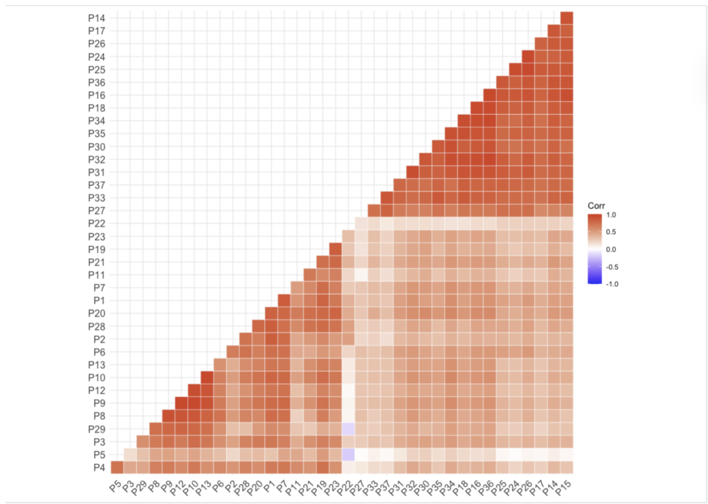
  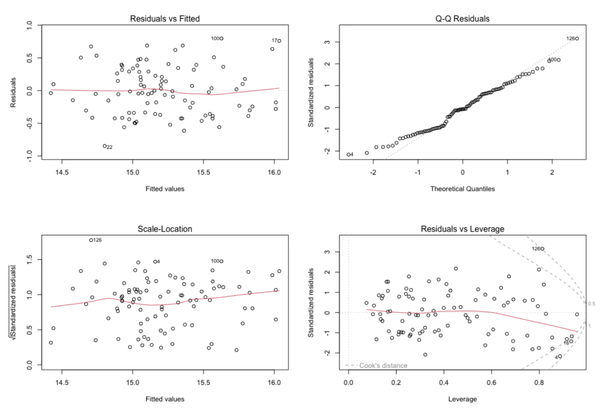

📄 [Full paper (PDF)](papers/restaurant-revenue-prediction.pdf) — ECON 695 coursework. Predictors are anonymized as P1–P37 in the source data, so this is a model-comparison exercise rather than an economic interpretation.

---

## Note on repositories

Most of what I build is in private repos — CareerLab and Revio have real users, so the code stays closed. The pinned repos here are coursework and research code I can share openly, plus write-ups of the architecture behind the private projects.

---

## Stack

**Languages** Python · TypeScript · Java · SQL · R · C
**Frontend** React · React Native · Next.js · Tailwind
**Backend** Node · Express · FastAPI · PostgreSQL · Supabase · Drizzle · Firebase
**AI/ML** LangChain · LangGraph · PyTorch · Pinecone · Milvus · RAG architectures
**Infra** Docker · Vercel · Render · Git · Linux

---

📫 [ia2629@columbia.edu](mailto:ia2629@columbia.edu) · [LinkedIn](https://www.linkedin.com/in/iahmadli/)
